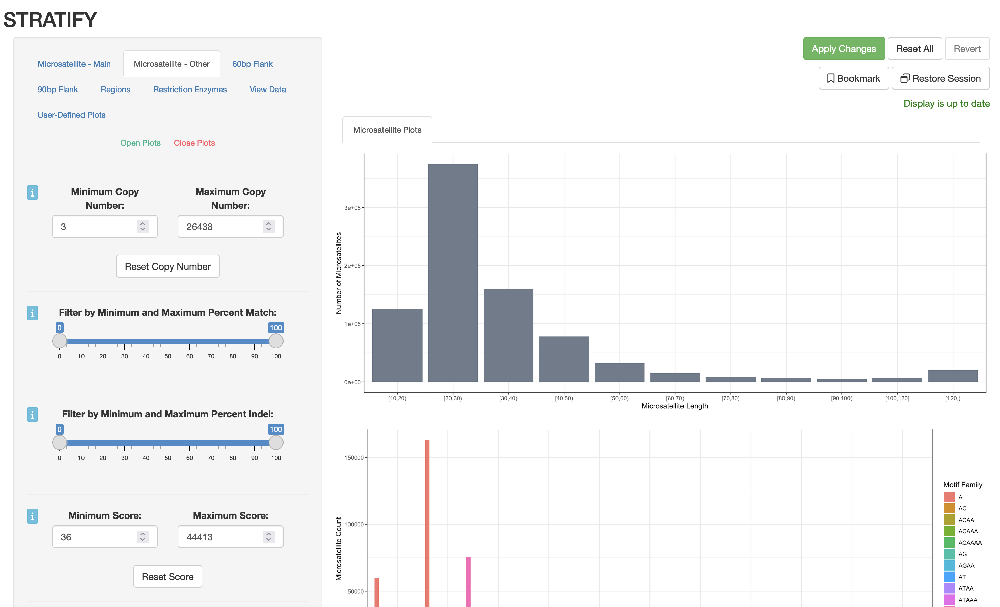

# STRATIFY: Short Tandem Repeat Analysis and Target Identification
**STRATIFY** (**S**hort **T**andem **R**epeat **A**nalysis and **T**arget **I**dentification) is a user-friendly, web-based <a href="https://github.com/rstudio/shiny">Shiny</a> app that allows users to filter short tandem repeats, also known as microsatellites, from the human genome based on desired features (e.g. percent GC content, microsatellite length, or mappability of the microsatellite’s flanking regions). STRATIFY also features plots for data visualization and quality control. 
  
An important application is designing panels of microsatellites for targeted profiling. Once the user has applied all desired filters and is satisfied with the quality of the microsatellites selected, they may export the microsatellite data, including any desired annotations, as a CSV file. STRATIFY's code can also be adapted by users for other genomes and to include other annotations not shown here.

<picture>   </picture>

## Requirements
STRATIFY requires the following to be installed before running, if not already installed:

- <a href="https://docs.github.com/en/repositories/working-with-files/managing-large-files/installing-git-large-file-storage">git lfs</a>
  - After installation, need to run once: `git lfs install`
- <a href="https://www.r-project.org/">R</a>
- The following R packages: shiny, shinyjs, shinyWidgets, shinybusy, shinyBS, shinyalert, memoise, dplyr, readr, data.table, ggplot2, GenomicRanges.
  - These packages can be installed with the command: `install.packages(c("shiny","shinyjs","shinyWidgets","shinybusy","shinyBS","shinyalert","memoise","dplyr","readr","data.table","DT","ggplot2","GenomicRanges"))`

## Running STRATIFY
To download and run STRATIFY, navigate to the desired download directory and run the following from the command line:

```bash
git clone https://github.com/evronylab/STRATIFY.git
Rscript -e "library(methods); shiny::runApp('STRATIFY', launch.browser = TRUE)"
```

## Note on file and directory names
IMPORTANT NOTE: The following files and directories must be present in the same directory, and each must be named EXACTLY as below (case-sensitive) in order for STRATIFY to work properly. This will be the case if you download STRATIFY from github per above. If you need to use different file or directory names, you must update each appearance of the file/directory names in the app.R file.
<ol type= "1">
<li>The app.R file that contains the UI and server components</li>
<li>The .csv.zip file containing the microsatellites + annotations ("hg-38.2.7.7.80.10.36.6.final.csv.zip")</li>
<li>A cache directory with read, write, and execute permissions for all users</li>
<li>A regionfilters_static directory with read, write, and execute permissions for all users</li>
<li>A restriction-enzyme_filters directory with read, write, and execute permissions for all users</li>
</ol>

## Running STRATIFY with a different reference genome
To run STRATIFY with a different reference genome, you must have a .csv.zip file containing the microsatellites + annotations. See [here](other_genomes.md) for more information on how to generate the requisite file from .fasta files for any reference genome. That file must be in the main STRATIFY directory with the app.R file. Additionally, you will need to replace each reference to the default hg38 .csv.zip file ("hg-38.2.7.7.80.10.36.6.final.csv.zip") in the app.R file with the new .csv.zip filename. 

For example, to run STRATIFY with the hg19 reference genome, you can replace the hg-38.2.7.7.80.10.36.6.final.csv.zip file in the main STRATIFY directory with a file with a new "hg-19.2.7.7.80.10.36.6.final.csv.zip" file. Then, in app.R, replace each reference to the "hg-38.2.7.7.80.10.36.6.final.csv.zip" file with "hg-19.2.7.7.80.10.36.6.final.csv.zip".

## Citing STRATIFY
<p>If you use STRATIFY, please cite:

Loh CA*, Shields DA*, Schwing A, Evrony GD. High-fidelity, large-scale targeted profiling of microsatellites. Genome Research, 34, 1008-1026 (2024). [https://genome.cshlp.org/content/34/7/1008](https://genome.cshlp.org/content/34/7/1008).</p>
